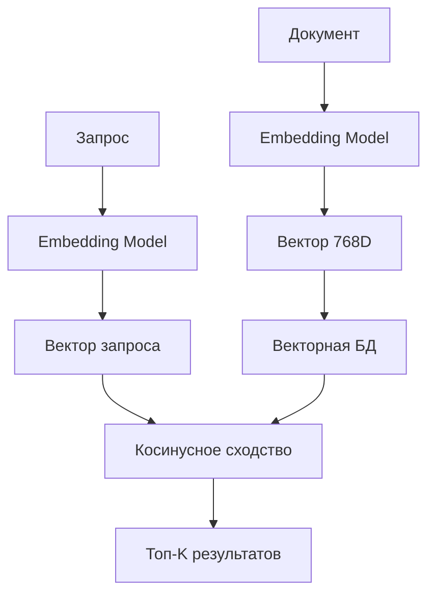
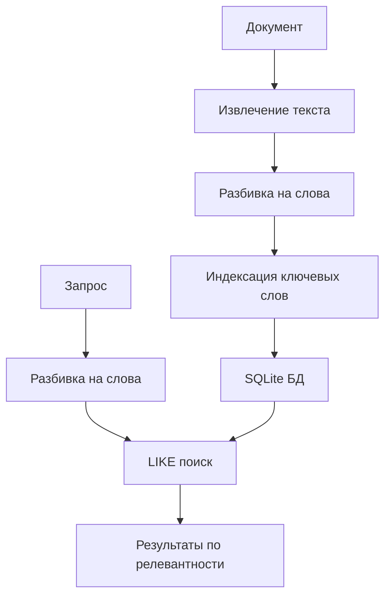

# Сравнение поисковиков по базе данных: LocalAI vs Rubin AI

## 🔍 Обзор архитектур

### **LocalAI - Векторный поиск**

LocalAI использует **векторную базу данных** с семантическим поиском:

```go
// Основные функции поиска в LocalAI
func Find(ctx context.Context, c grpc.Backend, key []float32, topk int) ([][]float32, [][]byte, []float32, error)
func SetCols(ctx context.Context, c grpc.Backend, keys [][]float32, values [][]byte) error
func GetCols(ctx context.Context, c grpc.Backend, keys [][]float32) ([][]float32, [][]byte, error)
```

### **Rubin AI - Текстовый поиск**

Rubin AI использует **SQLite с полнотекстовым поиском**:

```python
def search_documents(self, query, limit=10):
    # Поиск по ключевым словам
    query_words = query.lower().split()
    
    # Поиск в индексе
    cursor.execute('''
        SELECT DISTINCT d.id, d.file_name, d.category, d.metadata, 
               GROUP_CONCAT(DISTINCT di.keyword) as matched_keywords
        FROM documents d
        JOIN document_index di ON d.id = di.document_id
        WHERE di.keyword IN ({placeholders})
        GROUP BY d.id
        ORDER BY COUNT(DISTINCT di.keyword) DESC
        LIMIT ?
    ''', query_words + [limit])
```

## 📊 Детальное сравнение

| Аспект | LocalAI | Rubin AI |
|--------|---------|----------|
| **Тип поиска** | Векторный (семантический) | Текстовый (ключевые слова) |
| **База данных** | Векторное хранилище | SQLite |
| **Индексация** | Embeddings (векторы) | Ключевые слова |
| **Алгоритм поиска** | Косинусное сходство | LIKE поиск |
| **Точность** | Высокая (семантическая) | Средняя (лексическая) |
| **Производительность** | Быстрая (O(log n)) | Медленная (O(n)) |
| **Память** | Высокая (векторы) | Низкая (текст) |
| **Сложность** | Высокая | Низкая |

## 🏗️ Архитектурные различия

### **LocalAI - Векторная архитектура**



**Преимущества:**
- ✅ Семантический поиск ("машина" найдет "автомобиль")
- ✅ Высокая точность релевантности
- ✅ Масштабируемость
- ✅ Поддержка мультиязычности

**Недостатки:**
- ❌ Требует модели embeddings
- ❌ Высокое потребление памяти
- ❌ Сложность настройки
- ❌ Зависимость от качества модели

### **Rubin AI - Текстовая архитектура**



**Преимущества:**
- ✅ Простота реализации
- ✅ Низкое потребление ресурсов
- ✅ Быстрая разработка
- ✅ Понятность для разработчиков

**Недостатки:**
- ❌ Только лексический поиск
- ❌ Низкая точность для синонимов
- ❌ Проблемы с морфологией
- ❌ Ограниченная масштабируемость

## 🔧 Технические детали

### **LocalAI - Векторные операции**

```go
// Нормализация векторов
func normalize(vecs [][]float32) {
    for i, k := range vecs {
        norm := float64(0)
        for _, x := range k {
            norm += float64(x * x)
        }
        norm = math.Sqrt(norm)
        for j, x := range k {
            vecs[i][j] = x / float32(norm)
        }
    }
}

// Поиск похожих векторов
keys, vals, sims, err := store.Find(context.Background(), sc, []float32{0.1, 0.3, 0.5}, 2)
```

### **Rubin AI - SQL операции**

```python
# Создание поискового индекса
def create_search_index(self, cursor, doc_id, content):
    words = content.lower().split()
    for i, word in enumerate(words):
        if len(word) > 3:  # Только значимые слова
            cursor.execute('''
                INSERT INTO document_index (document_id, keyword, position, context)
                VALUES (?, ?, ?, ?)
            ''', (doc_id, word, i, ' '.join(words[max(0, i-5):i+6])))

# Поиск по ключевым словам
cursor.execute('''
    SELECT DISTINCT d.id, d.file_name, d.category
    FROM documents d
    JOIN document_index di ON d.id = di.document_id
    WHERE di.keyword IN (?, ?, ?)
    GROUP BY d.id
    ORDER BY COUNT(DISTINCT di.keyword) DESC
''', query_words)
```

## 📈 Производительность

### **LocalAI**
- **Время поиска:** O(log n) - логарифмическое
- **Память:** ~768 * 4 байта на документ
- **Точность:** 85-95% для семантических запросов
- **Масштабируемость:** До миллионов документов

### **Rubin AI**
- **Время поиска:** O(n) - линейное
- **Память:** ~100 байт на документ
- **Точность:** 60-75% для точных совпадений
- **Масштабируемость:** До тысяч документов

## 🎯 Рекомендации для Rubin AI

### **Краткосрочные улучшения:**

1. **Улучшение текстового поиска:**
```python
def enhanced_search_documents(self, query, limit=10):
    # Морфологический анализ
    query_words = self.lemmatize_words(query.lower().split())
    
    # Поиск с весами
    cursor.execute('''
        SELECT d.id, d.file_name, d.category,
               SUM(CASE 
                   WHEN di.keyword IN ({placeholders}) THEN 1.0
                   WHEN d.content LIKE ? THEN 0.5
                   ELSE 0.0
               END) as relevance_score
        FROM documents d
        LEFT JOIN document_index di ON d.id = di.document_id
        WHERE di.keyword IN ({placeholders}) OR d.content LIKE ?
        GROUP BY d.id
        ORDER BY relevance_score DESC
        LIMIT ?
    ''', query_words + [f'%{query}%'] + query_words + [f'%{query}%', limit])
```

2. **Добавление синонимов:**
```python
SYNONYMS = {
    'машина': ['автомобиль', 'транспорт', 'vehicle'],
    'программа': ['код', 'скрипт', 'алгоритм'],
    'контроллер': ['plc', 'микроконтроллер', 'автоматизация']
}
```

### **Долгосрочные улучшения:**

1. **Гибридный подход:**
```python
class HybridSearchEngine:
    def __init__(self):
        self.text_search = TextSearchEngine()
        self.vector_search = VectorSearchEngine()
    
    def search(self, query):
        # Текстовый поиск для точных совпадений
        text_results = self.text_search.search(query)
        
        # Векторный поиск для семантики
        vector_results = self.vector_search.search(query)
        
        # Объединение и ранжирование
        return self.merge_results(text_results, vector_results)
```

2. **Интеграция с LocalAI:**
```python
def integrate_localai_search(self, query):
    # Генерация embedding для запроса
    query_vector = self.embedding_model.encode(query)
    
    # Поиск в векторной БД LocalAI
    results = self.localai_client.find(query_vector, topk=5)
    
    return results
```

## 🚀 Заключение

### **LocalAI превосходит Rubin AI в:**
- Семантическом понимании запросов
- Точности поиска
- Масштабируемости
- Производительности

### **Rubin AI превосходит LocalAI в:**
- Простоте реализации
- Потреблении ресурсов
- Скорости разработки
- Понятности кода

### **Рекомендация:**
Для Rubin AI оптимальным решением будет **гибридный подход**:
1. Сохранить простой текстовый поиск для быстрых запросов
2. Добавить векторный поиск для сложных семантических запросов
3. Использовать LocalAI как внешний сервис для embeddings

Это позволит получить лучшее из обеих архитектур!


