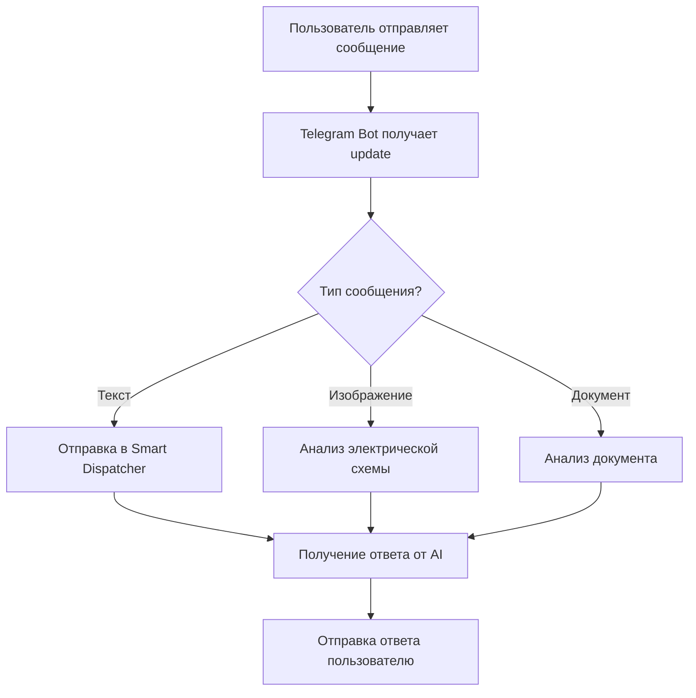

# Telegram Bot Guide

Руководство по настройке и использованию Telegram Bot для Rubin AI v2.

## 📱 Обзор

Telegram Bot обеспечивает взаимодействие с системой Rubin AI через популярный мессенджер Telegram. Бот пересылает сообщения пользователей в Smart Dispatcher и возвращает ответы.

## 🚀 Возможности

- **Чат-интерфейс** - общение с AI через Telegram
- **Анализ документов** - загрузка и анализ файлов
- **Анализ изображений** - обработка электрических схем
- **Многоязычность** - поддержка русского и английского языков
- **Контекстные диалоги** - сохранение истории разговоров

## ⚙️ Настройка

### 1. Создание Telegram Bot

1. Откройте Telegram и найдите [@BotFather](https://t.me/botfather)
2. Отправьте команду `/newbot`
3. Следуйте инструкциям для создания бота
4. Сохраните полученный токен

### 2. Настройка переменных окружения

```bash
# Добавьте в .env файл
TELEGRAM_BOT_TOKEN=your_bot_token_here
```

### 3. Запуск бота

```bash
python telegram_bot.py
```

## 🔧 Конфигурация

### Основные настройки

```python
# В telegram_bot.py
TELEGRAM_TOKEN = os.getenv("TELEGRAM_BOT_TOKEN", "")
SMART_DISPATCHER_URL = "http://localhost:8080/api/chat"
ELECTRICAL_GRAPH_URL = "http://localhost:8087/api/graph/analyze"
```

### Порты и URL

- **Smart Dispatcher**: `http://localhost:8080`
- **Electrical Module**: `http://localhost:8087`
- **Timeout**: 25 секунд для long polling

## 📡 API Endpoints

### Внутренние вызовы

- `POST /api/chat` - Основной чат с Smart Dispatcher
- `POST /api/graph/analyze` - Анализ электрических схем
- `POST /api/graph/digitize` - Оцифровка схем

## 💬 Команды бота

### Основные команды

- `/start` - Начало работы с ботом
- `/help` - Справка по командам
- `/status` - Статус системы
- `/health` - Проверка здоровья модулей

### Специальные функции

- **Отправка изображения** - автоматический анализ электрических схем
- **Отправка документа** - анализ текстовых файлов
- **Текстовые сообщения** - обычный чат с AI

## 🔄 Workflow



## 🛠️ Разработка

### Структура файла

```python
# Основные функции
def get_updates()          # Получение обновлений
def send_message()         # Отправка сообщений
def send_document()        # Отправка документов
def analyze_electrical()   # Анализ электрических схем
def process_message()      # Обработка сообщений
```

### Добавление новых команд

1. Добавьте обработчик в функцию `process_message()`
2. Создайте соответствующую функцию
3. Обновите справку в `/help`

### Логирование

```python
import logging
logger = logging.getLogger("telegram_bot")
logger.info("Message processed successfully")
```

## 🐛 Отладка

### Общие проблемы

1. **Бот не отвечает**
   - Проверьте токен бота
   - Убедитесь, что Smart Dispatcher запущен
   - Проверьте логи

2. **Ошибки анализа изображений**
   - Проверьте доступность Electrical Module
   - Убедитесь в корректности URL

3. **Проблемы с документами**
   - Проверьте размер файла (лимит Telegram)
   - Убедитесь в поддержке формата

### Логи

```bash
# Просмотр логов
tail -f telegram_bot.log

# Отладка
python -u telegram_bot.py
```

## 🔒 Безопасность

### Рекомендации

- Используйте переменные окружения для токенов
- Ограничьте доступ к боту по необходимости
- Регулярно обновляйте зависимости
- Мониторьте использование API

### Ограничения Telegram

- Максимальный размер файла: 50MB
- Максимальная длина сообщения: 4096 символов
- Rate limiting: 30 сообщений в секунду

## 📊 Мониторинг

### Метрики

- Количество сообщений в день
- Время ответа системы
- Успешность обработки запросов
- Использование различных модулей

### Health Check

```python
def check_system_health():
    """Проверка здоровья всех модулей"""
    health_status = {
        "smart_dispatcher": check_endpoint(SMART_DISPATCHER_URL),
        "electrical_module": check_endpoint(ELECTRICAL_GRAPH_URL)
    }
    return health_status
```

## 🚀 Развертывание

### Локальное развертывание

```bash
# Установка зависимостей
pip install requests python-telegram-bot

# Запуск
python telegram_bot.py
```

### Docker развертывание

```dockerfile
FROM python:3.9-slim
COPY telegram_bot.py .
COPY requirements.txt .
RUN pip install -r requirements.txt
CMD ["python", "telegram_bot.py"]
```

### Production настройки

- Используйте webhook вместо long polling
- Настройте reverse proxy
- Добавьте мониторинг и алерты
- Используйте HTTPS для webhook

## 📚 Дополнительные ресурсы

- [Telegram Bot API Documentation](https://core.telegram.org/bots/api)
- [python-telegram-bot Library](https://python-telegram-bot.readthedocs.io/)
- [Telegram Bot Best Practices](https://core.telegram.org/bots/best-practices)
